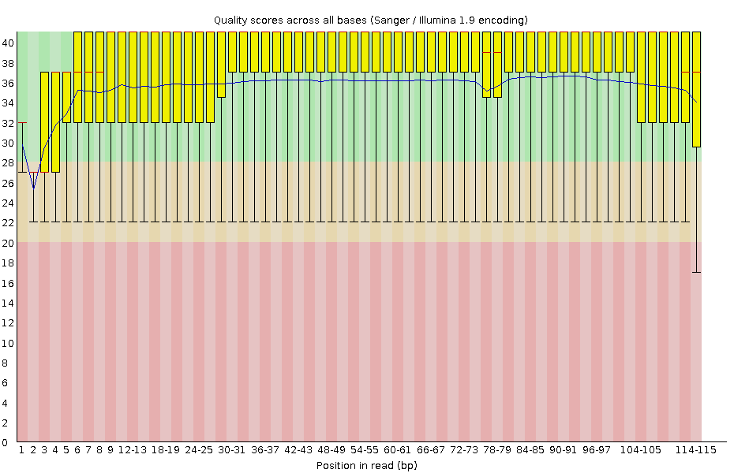
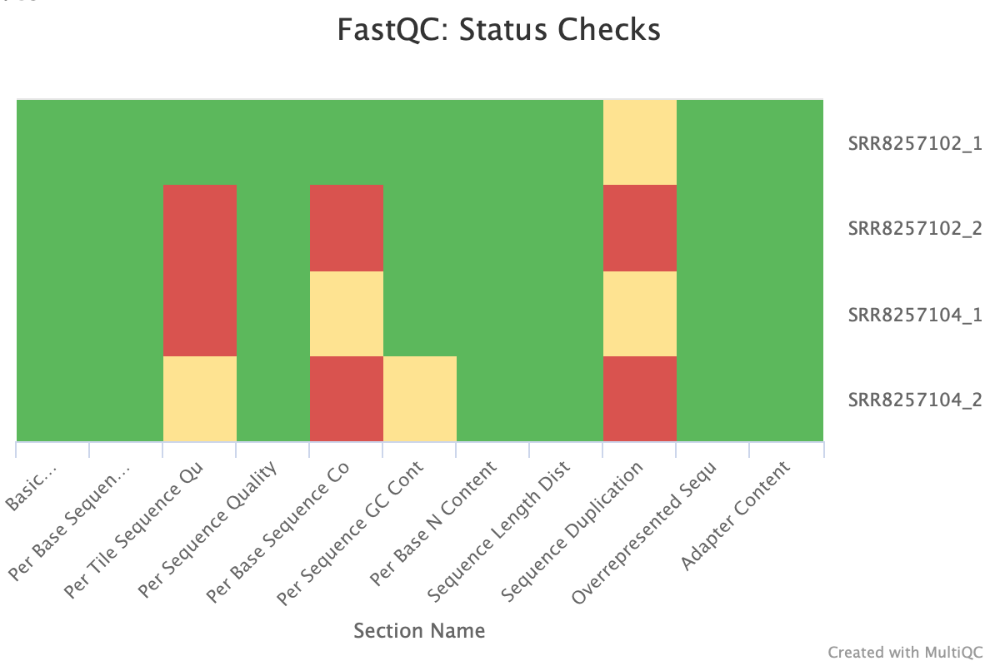
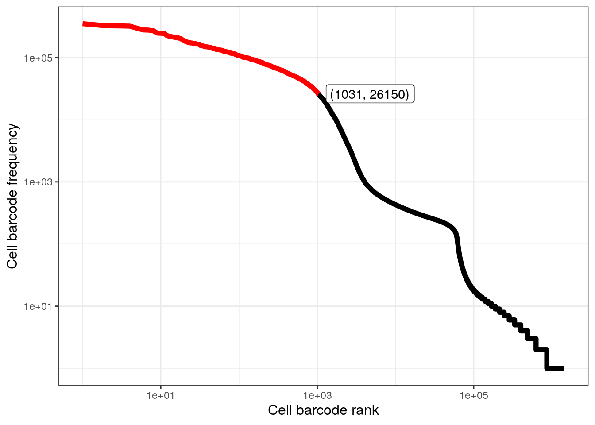
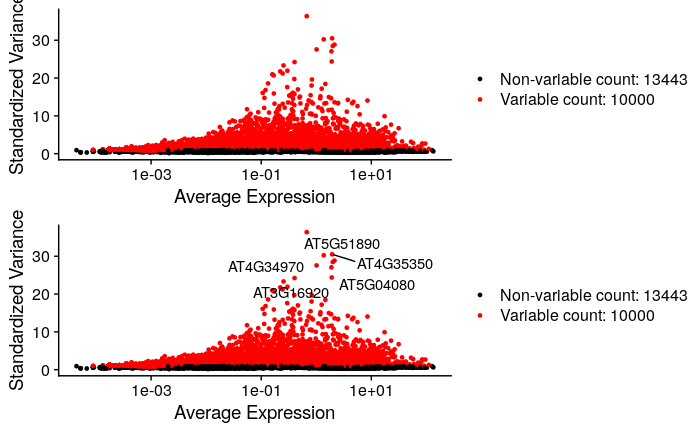
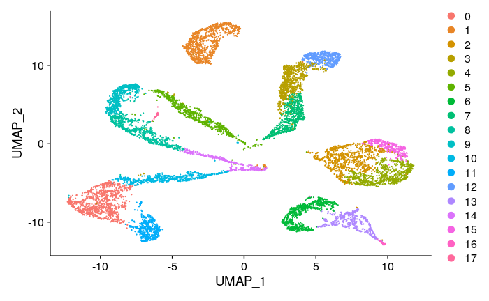
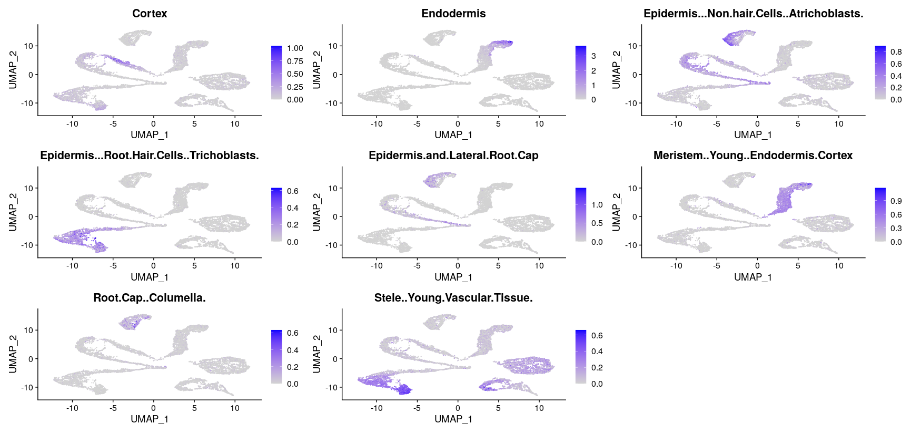
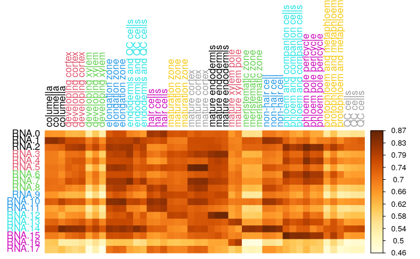
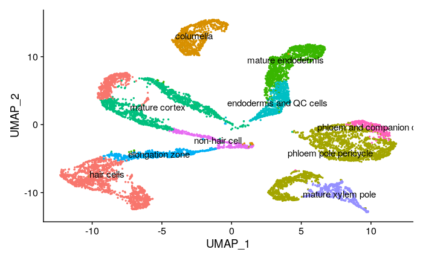
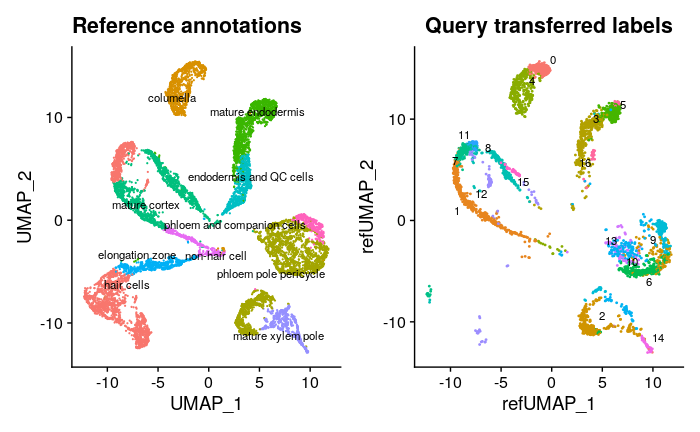

# TP NGS

Building an atlas of Arabidopsis cell types from Single-Cell RNA-seq

TP encadré par Marie Sémon, Carine Rey, Alice Hugues, Romain Bulteau. 

Groupe Scarabi : Allegra Seeler, Sasha Darmon, Simon Lacombe, Léna Andrieux 

# Origin of the data

On travaille sur des données de scRNAseq d'A. thaliana, obtenues sur des protoplastes de racines. Les protoplastes sont des cellules dont la paroi cellulaire a été digéré (retirée). 

Les données de scRNAseq ont été obtenues par 10X Genomics Chromium. Cette technique utilise des billes aux propriétés magnétiques permettant l'isolation de cellules uniques, qui sont étiquetées par des barcodes, et dont les transcrits sont identifiés par des UMI. Cela permet de récupérer l'expression génétique lors de l'échantillonage. 

Les données sont stockées dans GEO database (NCBI) sous le code GSE123013.

Chaque membre du groupe travaille sur un WT et un mutant. J'ai travaillé sur le WT 3 et le mutant 5. 

# Première semaine : 

### Import des données

L'import des données est codé dans le shell download.sh (rangé dans les scripts). On n'importe que les reads 1 et 2; le troisième ne porte pas d'information d'expression. 

### Contrôle qualité

On utilise fastqc afin d'effectuer un contrôle qualité de nos données. 
Cette action est codée dans le shell runfastqc.sh dans le dossier script. 
Les résultats de ce contrôle qualité sont dans le dossier results -> fastqc_analysis. On peut par exemple observer le socre qualité du séquençage illumina : 

Ils sont par contre difficile a lire, on peut donc utiliser multiqc pour compiler les résultats et avoir un contrôle global de nos données. Le shell s'appelle multiqc.sh dans le dossier script. Les résultats sont dans results -> analyse_controle_qualite -> multiqc_data. L'ouverture dans le Web Browser permet de contrôler la qualité des données. 

Les données étant satisfaisantes, on peut continuer avec l'analyse par Alevin. 

## Alevin

### Téléchargement des données du transcriptome

Les données du transcriptome sont retrouvées dans la documentation Salmon.  (https://ics.hutton.ac.uk/atRTD/RTD2/AtRTD2_19April2016.fa).
Les données sont téléchargées grâce au code dans import_transcriptome.sh dans les scripts 

Dans le dossier data: 
• le document arabidopsis_transcriptome.fa contient la séquence 
• le document arabidopsis_transcriptome.gtf contient toute l'information générale 

### Création du salmon index nécessaire pour run alevin ensuite

Le code permettant la création du salmon index est dans le script import_transcriptome.sh
Il est rangé dans un sous-dosser index_salmon dans le dossier data_processed

### Création de la tg map : un ficher de correspondance avec les transcrits 

Dans le shell import_transcriptome.sh, la commande bioawk permet la créatino de la tgmap. 
On prend la neuvième colonne des lignes qui correspondent à des exons (première ligne)
On sélectionne les identifiants seulement avec les substr, sans les guillemets etc
On met ce qu'on obtient dans le fichier txp2gene qui se trouve dans le dossier data_processed

### Running Alevin

On peut maintenant lancer Alevin grâce au script alevin.sh. 
On le run une fois pour le WT et une fois pour le mutant. 
Pour le lancer il faut utiliser les données de transcriptome, le salmon index et la tgmap (appelée txp2gene)

Résultats du knee plot pour déterminer le palier des cellules selectionnées pour l'analyse : 

 

## Tools

### Salmon and Alevin
Compter le nombre de cellules analysées et attribuer le nom du gène à chaque segment séquencé : 
https://salmon.readthedocs.io/en/latest/salmon.html

### AlevinQC
Ouvrir et visualiser les données obtenues par Alevin. Il faut installer le package "httpuv" puis AlvinQC. Documentation disponible : https://csoneson.github.io/alevinQC/
Installer la version bioconductor : https://www.bioconductor.org/packages/devel/bioc/html/alevinQC.html

# Deuxième semaine : analyse de nos données et attribution des types cellulaires 

Pour l'analyse avec, il faut importer les packages "Seurat" and "tximport". 
Documentation disponible sur "https://satijalab.org/seurat/articles/pbmc3k_tutorial.html"

D'abord on importe les données de tous les échantillons dans le shell import_donnestotales à partir des données publiées dans  https://flower.ens-lyon.fr/tp_ngs/scarabi/Alevin/quant. 
Username : tp_ngs
Password : Arabido2021!

Résolution de l'analyse : 0.5 

Les marqueurs cellulaires sont importés par le code du shell data_markers.sh.
Dans un premier temps on a importé le fichier csv des associations de marqueurs de gènes pour chaque type cellulaire = méthode marqueurs génétiques. 
Dans un second temps, pour la deuxième analyse, on a importé les données brutes obtenues par dissection de chaque type cellulaire = méthode types cellulaires connus. 

Pour information, l'analyse est réalisée ici avec 10 000 gènes "high variable features". Dans le groupe, l'analyse a aussi été réalisée avec 2000, 5000 et 8000 gènes. 

Quelques résultats principaux sont représentés ci-dessus par leur figure : 

### UMAP 

Première technique par marqueurs génétiques d'une librairie

UMAP présentant les différents types cellulaires par clusters : 

Corrplot par expression moyennée des differents marqueurs génétiques par clusters : 

Deuxième technique par utilisation des marqueurs de dissection par type cellulaire : 

Comparaison de l'UMAP entre le WT et le mutant par projection des cellules du mutants sur l'UMAP du WT : chez le mutant rhd6, il manque les hair cells. 

Pour le reste de l'analyse, se réferrer au Rscript_week2.Rmd enitèrement annoté en markdown, étape par étape. 

PS : problème lié au git -> création d'un nouveau git avec les fichiers à évaluer (Readme, script; et Rproj) qui sont commit et push dans le nouveau git. 
